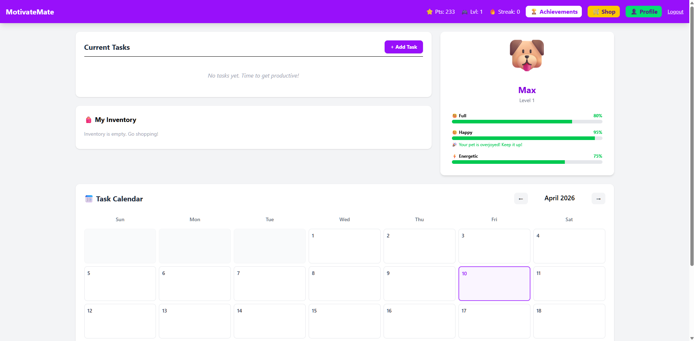
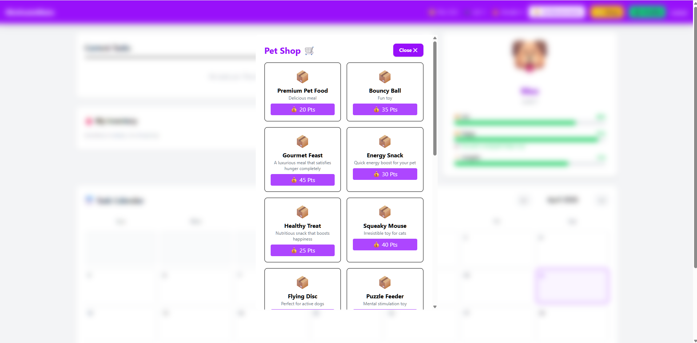
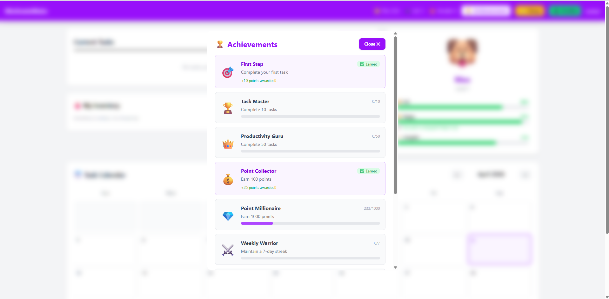
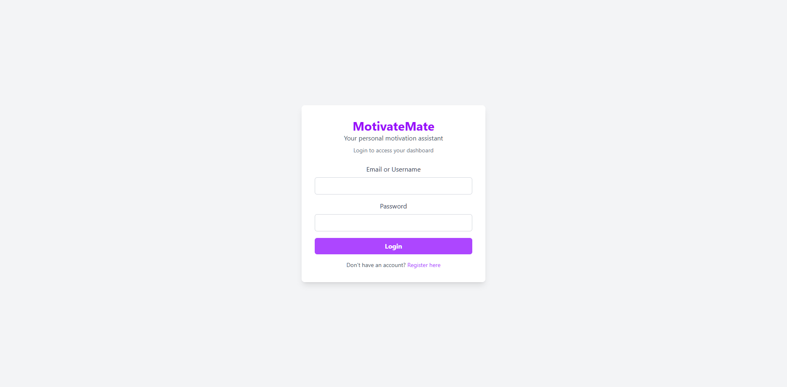
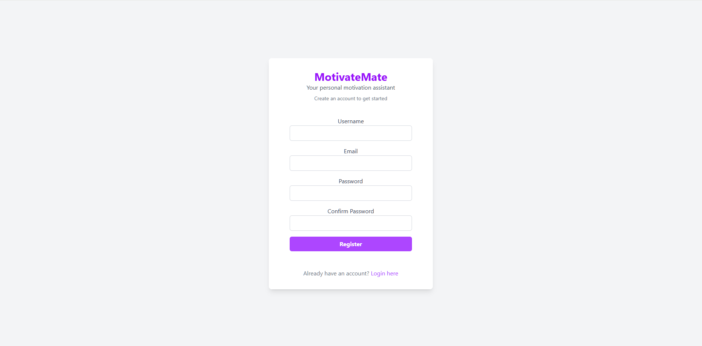
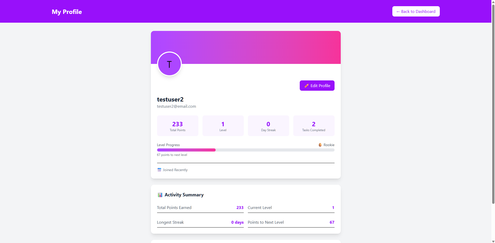

# 🐱 MotivateMate

### Gamified Task Management with Virtual Pet Motivation

## Deployment:

### Tech stack on Render:
- Frontend : Static Site (React + Vite)
- Backend : Web Service (Node.js + Express)
- Datanase : PostgreSQL
  
[](https://motivatemate-b7wl.onrender.com/api/health)
---

[](https://motivatemateapp.onrender.com)

```text
Test Credentials:
Username/Email: testuser1/testuser1@email.com
Password: Password
```

Or rgister your own account
---

###

## 📋 Overview

**MotivateMate** is a full-stack web application that transforms productivity into an engaging game. Users complete tasks to earn points, care for a virtual pet, and unlock achievements. The pet's well-being directly reflects the user's productivity, creating a positive feedback loop that builds lasting habits.

### 🎯 The Problem

Traditional task managers are functionally effective but emotionally sterile. 80% of users abandon task apps within one month because checkmarks don't create habits. Users need motivation, not just organization.

### ✨ The Solution

MotivateMate transforms task completion into a rewarding game loop:
1.	Users create tasks with priority (low/medium/high/urgent) and difficulty (easy/medium/hard)
2.	Completing tasks earns points calculated as priority × difficulty multiplier
3.	Points are spent in a shop to purchase items (food, toys, accessories, consumables)
4.	Items are used on a virtual pet to improve its hunger, happiness, and energy stats
5.	The pet's well-being reflects user productivity, creating positive reinforcement
6.	Achievements unlock at milestones, providing long-term goals

This creates a psychological feedback loop where productivity becomes intrinsically rewarding, addressing the motivation gap in traditional task managers.

## Screenshots
| Dashboard                                    | Shop                               | Achievements                                       |
| -------------------------------------------- | ---------------------------------- | -------------------------------------------------- |
|  |  |  |

| Login                                | Register                                   | User Profile                                       |
| ------------------------------------ | ------------------------------------------ | -------------------------------------------------- |
|  |  |  |


## 🛠️ Tech Stack

### Frontend
| Technology       | Version | Purpose                       |
| ---------------- | ------- | ----------------------------- |
| **React**        | 19      | UI framework                  |
| **Tailwind CSS** | 4       | Styling and responsive design |
| **Vite**         | 8       | Build tool and dev server     |
| **React Router** | 7       | Client-side routing           |

### Backend
| Technology     | Version | Purpose                     |
| -------------- | ------- | --------------------------- |
| **Node.js**    | 22      | JavaScript runtime          |
| **Express**    | 4       | Web framework               |
| **PostgreSQL** | 17      | Relational database         |
| **Sequelize**  | 6       | ORM for database operations |
| **JWT**        | 9       | Authentication tokens       |
| **bcryptjs**   | 2       | Password hashing            |

### Deployment
| Service        | Purpose                 |
| -------------- | ----------------------- |
| **Render.com** | Backend API hosting     |
| **Render.com** | PostgreSQL database     |
| **Render.com** | Frontend static hosting |

## ✨ Features

### 🔐 Authentication
- User registration with username, email, and password
- Secure login with JWT tokens (7-day expiration)
- Password hashing with bcrypt (10 salt rounds)
- Protected routes and API endpoints
- Profile update functionality

### 📝 Task Management
- Create tasks with title, description, priority, difficulty, and due date
- Edit and delete existing tasks
- Mark tasks complete to earn points
- Points calculated as: `priority × difficulty multiplier`

| Priority | Base Points | Easy (1x) | Medium (1.5x) | Hard (2x) |
| -------- | ----------- | --------- | ------------- | --------- |
| Low      | 10          | 10        | 15            | 20        |
| Medium   | 25          | 25        | 38            | 50        |
| High     | 50          | 50        | 75            | 100       |
| Urgent   | 75          | 75        | 113           | 150       |

### 🐾 Virtual Pet
- Each user gets a pet with random name from 20 options
- Pet types: cat (🐱), dog (🐶), owl (🦉)
- Three stats: Hunger, Happiness, Energy (0-100%)
- Use items from inventory to improve stats
- Positive messages when stats are high
- Stats decay over time when neglected (future implementation)
- Visual warnings when stats are low (future implementation)

### 🛒 Shop & Inventory
- 18 purchasable items (food, toys, accessories, consumables)
- Items have different effects (hunger, happiness, energy, cosmetic)
- Rarity system: common, uncommon, rare, epic, legendary
- Purchase items using earned points
- Inventory tracks quantities with unique constraints
- Item usage decreases quantity or removes item

### 🏆 Achievements


- Bonus points awarded when achievements are earned
- 9 achievements with different criteria:

| Achievement       | Criteria          | Reward Points |
| ----------------- | ----------------- | ------------- |
| First Step        | Complete 1 task   | 10            |
| Task Master       | Complete 10 tasks | 50            |
| Productivity Guru | Complete 50 tasks | 200           |
| Point Collector   | Earn 100 points   | 25            |
| Point Millionaire | Earn 1000 points  | 100           |
| Weekly Warrior    | 7-day streak      | 75            |
| Monthly Champion  | 30-day streak     | 200           |
| Pet Lover         | Pet level 5       | 50            |
| Pet Master        | Pet level 10      | 100           |


### 📅 Calendar
- Month view calendar with task indicators
- Days with tasks show count badges
- Today highlighted in purple
- Click any date to see tasks scheduled
- Tasks show priority badges and completion status

### 👤 User Profile
- View stats: points, level, streak, numbers of tasks completed
- Level titles from "Rookie" to "Mythical"
- Progress bar to next level
- Edit username and email
- Member since date
